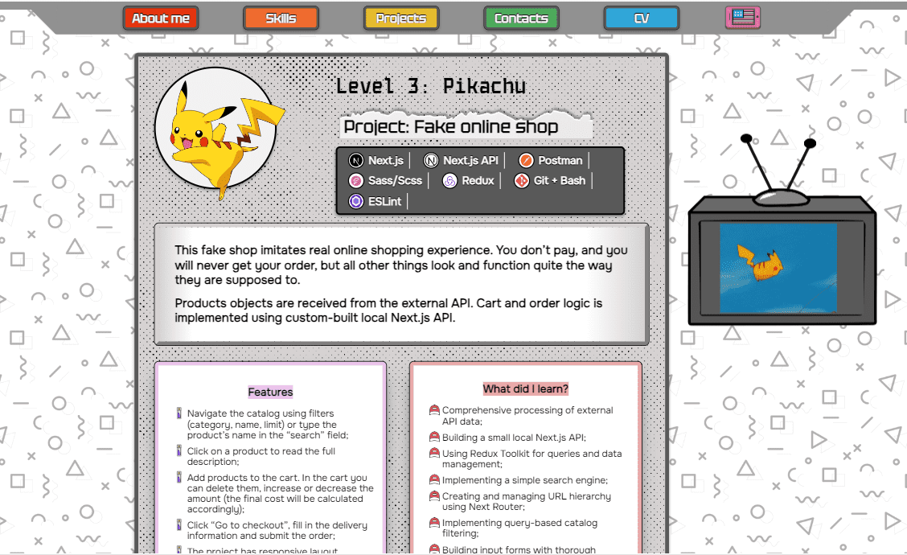

> I am a junior front-end developer.
>
> This pet project was created as my portfolio during my studies.

# Project: Portfolio

This portfolio was created to present my pet projects, which were built during my studies.

Visual design was created by me as well.

## Features

- All necessary information about me, my skills and my projects is presented in a "Pokémon evolution/collection" style;
- Use navbar to slide down to the needed section;
- Click on CV to get the PDF;
- Enjoy various animations;
- Get distracted with GIFs in TV;
- Read dinosaur jokes in the footer;
- The site has two versions: English and Ukrainian, your language choice is stored in a cookie.

## Skills used

- Next.js
- Sass/Scss
- Redux
- Git + Bash
- ESLint

## What did I learn

- Creating ~~a lot of~~ animations;
- Using Intersection Observer to activate animations on scroll;
- Using semantic HTML;
- Implementing a two-language interface with the use of cookies.

Here you can check the <a href="https://pryhun.me/" target="_blank">deployed site</a>!
